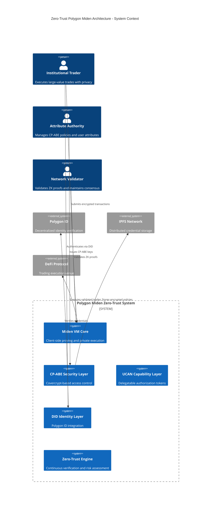
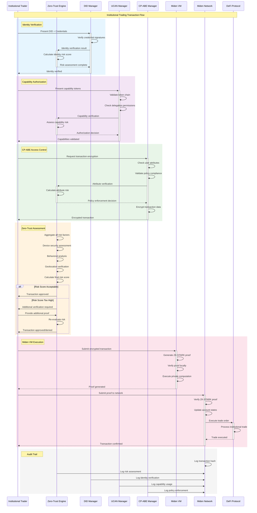
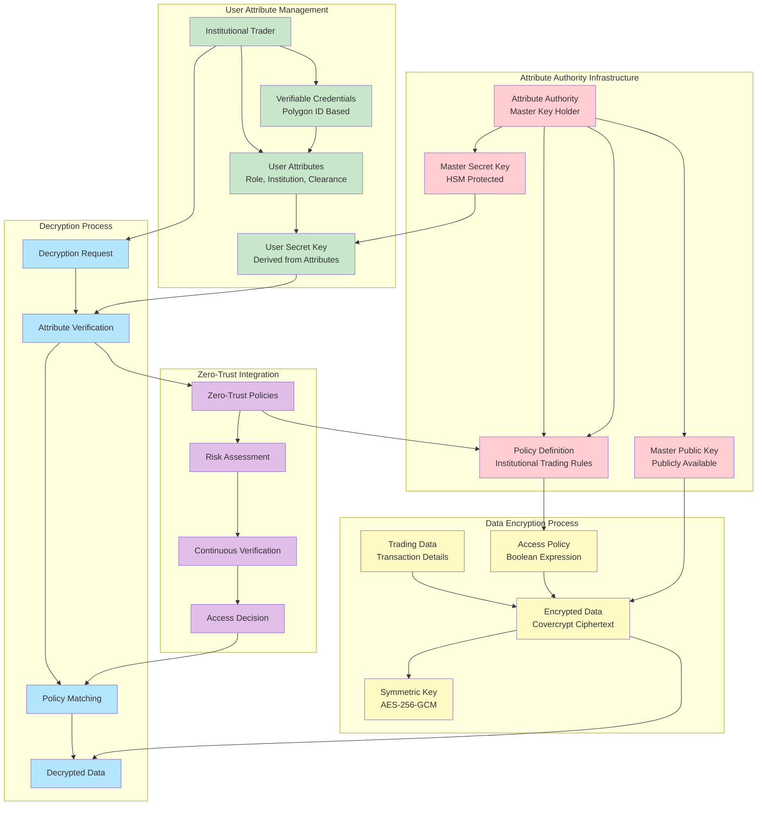
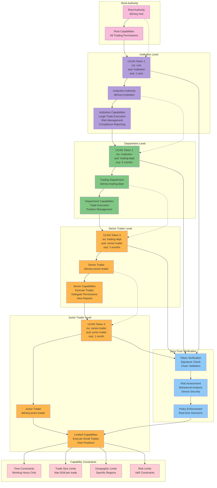
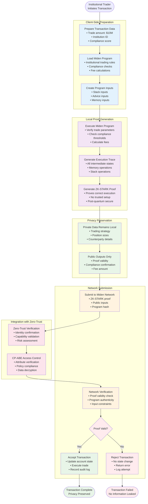
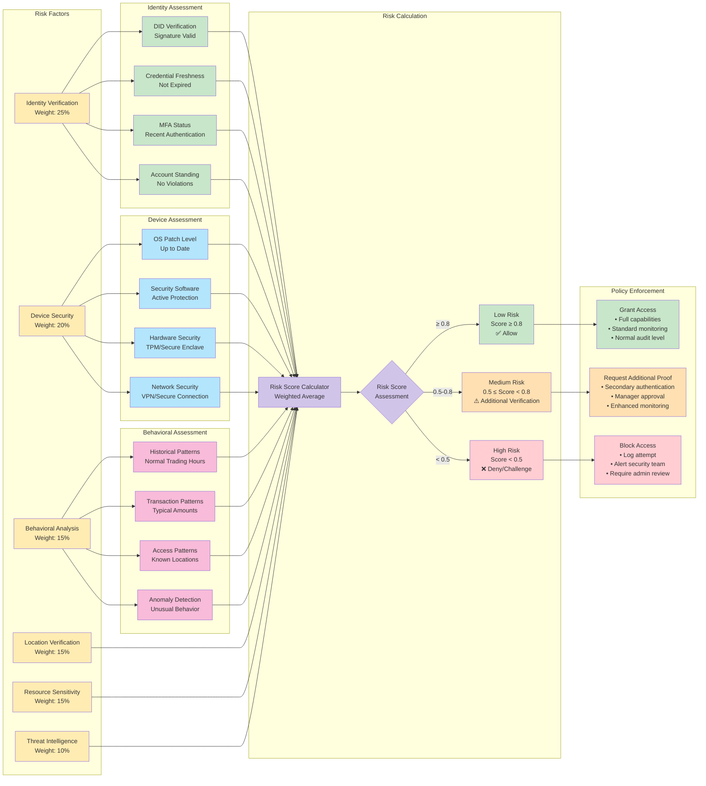

# Zero-Trust Architecture for Polygon Miden: Integrating CP-ABE, Capability-Based Security, and DID Frameworks

##  Summary

This proposal presents a comprehensive Zero-Trust architecture specifically designed for the Polygon Miden network, leveraging its unique client-side proving capabilities and actor-based transaction model. The architecture integrates Ciphertext-Policy Attribute-Based Encryption (CP-ABE) through Colossus, capability-based security via UCAN tokens, and decentralized identity management using Polygon ID. This integrated approach addresses the fundamental limitations of traditional blockchain security models while maximizing Polygon Miden's privacy-preserving and scalable features.

The proposed architecture transforms the traditional "trust and verify" model into a robust "never trust, always verify" framework, where every transaction, identity, and access request undergoes continuous verification through multiple cryptographic layers. By combining these technologies, the system provides fine-grained access control, privacy-preserving transaction execution, and comprehensive audit capabilities while maintaining the scalability benefits of client-side proving.

## Architecture Overview

The Zero-Trust Polygon Miden architecture consists of four primary layers that work in concert to provide comprehensive security coverage. The foundation layer leverages Polygon Miden's unique features, including the Miden VM's client-side proving capabilities, the actor-based account model, and the note-based transaction system. Above this sits the security enforcement layer, which implements Zero-Trust policy engines, CP-ABE attribute authorities, and UCAN capability management systems.
The identity layer manages decentralized identities through Polygon ID, providing self-sovereign identity capabilities while maintaining privacy through zero-knowledge proofs. The topmost application layer enables developers and users to interact with the system through privacy-preserving applications that leverage the underlying security infrastructure.

This layered approach ensures that security is not an afterthought but is embedded at every level of the system. The architecture specifically takes advantage of Polygon Miden's client-side proving to enable users to generate proofs locally while maintaining complete privacy over their transaction data. The integration of CP-ABE allows for fine-grained access control policies to be cryptographically enforced, while UCAN tokens provide delegatable capabilities that implement the principle of least privilege.

## Core Components Integration

### CP-ABE Implementation with Colossus

The architecture utilizes Colossus, which implements the ETSI-standardized CP-ABE scheme (Covercrypt), to provide fine-grained access control with post-quantum security guarantees. Colossus's hybrid approach combines traditional and post-quantum cryptography, ensuring long-term security while maintaining compatibility with existing systems. The implementation defines policy axes specific to blockchain use cases, such as transaction types, asset classes, geographical restrictions, and compliance requirements.

Attribute authorities manage different domains of attributes, such as financial services credentials, geographical locations, or organizational roles. These authorities operate independently, eliminating single points of failure while maintaining the ability to create complex access policies that span multiple domains. The CP-ABE keys are integrated with Polygon Miden's account system, allowing users to decrypt transaction data only when their attributes satisfy the embedded access policies.

### Capability-Based Security with UCAN

UCAN tokens provide delegatable capabilities that implement fine-grained authorization within the Polygon Miden ecosystem. Each UCAN token represents a specific permission or set of permissions that can be delegated from one party to another, creating verifiable chains of authorization. The integration with Polygon Miden's actor model allows capabilities to be associated with specific accounts and actions, ensuring that users can only perform operations for which they have explicit authorization.

The UCAN system works seamlessly with Polygon Miden's note-based transaction model, where capabilities can be embedded within notes to create programmable authorization logic. This approach enables sophisticated use cases such as time-limited access, conditional permissions, and automated capability revocation based on predefined triggers.

### Decentralized Identity with Polygon ID

Polygon ID serves as the foundation for identity management within the Zero-Trust architecture, providing self-sovereign identity capabilities through W3C-compliant DIDs and verifiable credentials. The integration leverages zero-knowledge proofs to enable privacy-preserving identity verification, allowing users to prove attributes about themselves without revealing sensitive information.

The DID documents are stored on-chain as commitments, with the actual credential data maintained off-chain by users. This approach ensures privacy while providing verifiable identity anchors that can be used by other components of the system. The integration with Polygon Miden's client-side proving allows users to generate proofs about their identity attributes locally, maintaining complete control over their personal information.

## Network Actors and Roles

The Zero-Trust Polygon Miden architecture involves multiple categories of actors, each with specific responsibilities and security controls. Understanding these roles is crucial for implementing effective security policies and maintaining system integrity.
### Primary Network Actors

**End Users** represent the primary beneficiaries of the system, capable of generating client-side zero-knowledge proofs, maintaining their private keys and DIDs, and executing transactions locally while managing their personal data privacy. They implement Zero-Trust principles by verifying their own identity, proving claims without revealing sensitive information, and maintaining least privilege access to system resources.

**DApp Developers** build privacy-preserving applications that leverage the Zero-Trust infrastructure, implementing CP-ABE access controls and capability-based authorization while designing secure integrations with the Miden VM. They follow secure-by-design principles, implement defense-in-depth strategies, and ensure that applications maintain the principle of least privilege.

**Node Operators** maintain the network infrastructure by operating Miden nodes, verifying zero-knowledge proofs, and processing transactions. They implement Zero-Trust principles by verifying all proofs without trusted execution environments and maintaining transparent operations while ensuring network security through continuous monitoring and validation.

**Validators** participate in the consensus mechanism, validating transactions and maintaining blockchain integrity through cryptographic consensus and immutable record-keeping. They implement continuous verification processes and stake-based incentive mechanisms to ensure network security and reliability.

### Security Infrastructure Actors

**Attribute Authorities** manage user attributes across different domains, issuing CP-ABE keys and defining access policies while handling attribute revocation. They implement distributed authority models that eliminate single points of failure while maintaining cryptographic enforcement of access policies.

**Zero-Trust Policy Engines** continuously evaluate access requests by calculating risk scores, enforcing security policies, and monitoring user behavior. They implement the core "never trust, always verify" principle through continuous monitoring and context-aware decision-making processes.

**DID Registries** manage decentralized identities by storing DID documents, enabling identity verification, and maintaining credential schemas. They ensure identity verification capabilities while maintaining document immutability and supporting self-sovereign identity principles.

**Capability Delegators** issue UCAN tokens and manage capability chains, handling delegation while enforcing least privilege principles. They maintain verifiable permission chains and ensure proper authorization enforcement throughout the system.

## Security Framework Implementation

### Zero-Trust Policy Enforcement

The Zero-Trust policy engine continuously evaluates multiple factors to determine access permissions, including user identity verification, device security posture, behavioral analysis, geographical location, resource sensitivity, and threat intelligence. Each access request receives a risk score based on these factors, with policies determining whether access is granted, additional authentication is required, or access is denied.

The policy engine integrates with all other components of the system, receiving identity information from Polygon ID, attribute data from CP-ABE authorities, and capability information from UCAN systems. This comprehensive approach ensures that access decisions are based on complete contextual information rather than static credentials or permissions.

### Continuous Verification and Monitoring

The architecture implements continuous verification through multiple mechanisms. Identity verification occurs at each transaction through DID-based authentication, while behavioral monitoring tracks user patterns to detect anomalies. Device security assessment ensures that only compliant devices can access sensitive resources, and geographical monitoring enforces location-based access policies.

The system maintains comprehensive audit logs that record all security decisions, access attempts, and policy evaluations. These logs are stored using immutable blockchain technology, ensuring that audit trails cannot be tampered with and providing complete transparency for compliance and forensic analysis.

### Privacy-Preserving Security Controls

The integration of zero-knowledge proofs throughout the system ensures that security controls can be enforced without compromising user privacy. Users can prove their identity, attributes, and permissions without revealing sensitive information, while the system maintains complete auditability and compliance capabilities.

The client-side proving capabilities of Polygon Miden enable users to generate proofs about their transactions locally, ensuring that sensitive business logic and transaction details remain private while still allowing for comprehensive security validation.

## Use Case: Institutional DeFi Trading

To demonstrate the practical application of the Zero-Trust Polygon Miden architecture, we present a detailed use case involving institutional DeFi trading. This scenario showcases how the integrated security framework handles high-value, privacy-sensitive transactions while maintaining full compliance and auditability.

### Scenario Overview

An institutional trader needs to execute a large trade (10 million USDC) through a DeFi protocol while maintaining transaction privacy, ensuring compliance with regulatory requirements, and providing full audit trails for internal and external oversight. The trade must be executed without revealing sensitive information about the institution's trading strategy or positions while still providing sufficient transparency for regulatory compliance.

### End-to-End Transaction Flow

The transaction flow demonstrates the seamless integration of all security components within the Zero-Trust framework. The process begins with identity verification through Polygon ID, where the institutional trader presents their DID and associated credentials. The system verifies the trader's institutional status and KYC compliance without exposing sensitive identity information.
The Zero-Trust policy engine evaluates the trade request based on multiple risk factors, including trade size, timing, historical behavior patterns, and current market conditions. The risk assessment considers the institutional nature of the trader, their compliance history, and the specific characteristics of the requested trade, resulting in a risk score that determines whether additional security measures are required.

Following successful risk assessment, the system initiates CP-ABE access control procedures. The Financial Services Attribute Authority issues a decryption key that allows the trader to access institutional trading policies and execute large-value transactions. This key is specifically tailored to the trader's attributes and the institutional trading context, ensuring that only authorized entities can access sensitive trading infrastructure.

### Capability Delegation and Execution

The UCAN capability system issues tokens that provide specific permissions for large trade execution. These tokens are time-limited and scoped to the specific transaction requirements, implementing the principle of least privilege while enabling the necessary trading functionality. The capability tokens are cryptographically verifiable and can be audited to ensure proper authorization.

The Miden VM performs client-side proof generation, creating zero-knowledge proofs that demonstrate the validity of the trade without revealing sensitive details about the trading strategy, position sizes, or timing. This approach ensures that the institutional trader maintains complete privacy over their trading activities while still providing cryptographic proof of compliance and validity.

The DeFi protocol receives the encrypted trade data along with the zero-knowledge proofs, verifying the proofs and executing the trade on the Miden blockchain. The execution maintains privacy through the use of private accounts and encrypted transaction data, while still providing sufficient information for proper settlement and risk management.

### Compliance and Audit Trail

Throughout the entire process, the system maintains comprehensive audit logs that record all security decisions, access attempts, and transaction details. These logs are designed to provide regulators and auditors with complete transparency while maintaining the privacy of sensitive trading information. The audit trail includes identity verification records, risk assessment results, capability usage logs, and transaction execution details.

The compliance system creates immutable records of all relevant activities, ensuring that regulatory requirements are met while maintaining the privacy and security benefits of the Zero-Trust architecture. This approach demonstrates how advanced cryptographic techniques can be used to satisfy both privacy and compliance requirements simultaneously.

## Security Benefits and Advantages

The integrated Zero-Trust Polygon Miden architecture provides significant advantages over traditional blockchain security approaches across multiple dimensions. These benefits are particularly pronounced in areas critical to enterprise adoption and regulatory compliance.
### Enhanced Security Posture

The architecture provides superior security through continuous verification rather than relying on perimeter-based defenses. Traditional blockchain systems often operate on implicit trust models where users are trusted once they gain access to the network. In contrast, the Zero-Trust approach requires continuous verification of every access request, transaction, and interaction within the system.

The integration of CP-ABE provides cryptographic enforcement of access policies, eliminating the risks associated with traditional access control lists that can be bypassed or misconfigured. The fine-grained nature of attribute-based access control ensures that users can only access resources for which they have explicit authorization, reducing the attack surface and minimizing potential damage from compromised accounts.

### Privacy-Preserving Operations

The architecture enables true privacy-preserving operations through the integration of zero-knowledge proofs, private accounts, and encrypted transaction data. Users can prove compliance and validity without revealing sensitive information, enabling new use cases that require both transparency and privacy.

The client-side proving capabilities of Polygon Miden ensure that users maintain complete control over their private data while still enabling comprehensive verification and audit capabilities. This approach addresses the fundamental tension between privacy and transparency that has limited blockchain adoption in privacy-sensitive industries.

### Scalability and Performance

The architecture leverages Polygon Miden's client-side proving to achieve superior scalability compared to traditional blockchain systems. By moving computation to the client side, the system reduces the burden on network infrastructure while enabling parallel processing and improved throughput.

The capability-based security model reduces the overhead associated with traditional access control mechanisms, while the CP-ABE integration provides efficient key management and policy enforcement. The combination of these technologies enables the system to scale to enterprise-level usage while maintaining security and privacy guarantees.

### Regulatory Compliance

The comprehensive audit capabilities and privacy-preserving design make the architecture well-suited for regulatory compliance in various industries. The system can provide regulators with complete transparency into activities while maintaining user privacy, addressing the compliance challenges that have limited blockchain adoption in regulated industries.

The immutable audit logs and verifiable compliance proofs ensure that organizations can demonstrate regulatory compliance without compromising competitive advantages or sensitive information. This capability is particularly important for financial services, healthcare, and other regulated industries.

## Implementation Considerations

### Technical Requirements

Implementing the Zero-Trust Polygon Miden architecture requires careful consideration of technical requirements and constraints. The system requires robust key management infrastructure to support CP-ABE operations, DID management, and UCAN token issuance. Organizations must implement secure key storage and management practices to protect the cryptographic keys that underpin the security model.

The integration of multiple cryptographic systems requires careful attention to performance optimization and resource management. The client-side proving capabilities must be balanced against computational requirements, and the system must be designed to handle the increased complexity of multi-layered security verification.

### Deployment Strategy

A successful deployment strategy should begin with pilot programs in controlled environments, allowing organizations to gain experience with the technology stack before full-scale deployment. The modular nature of the architecture enables gradual adoption, with organizations able to implement individual components and integrate them over time.

The system should be designed with crypto-agility in mind, enabling rapid updates to cryptographic algorithms and protocols as standards evolve. This flexibility is particularly important given the rapidly evolving nature of post-quantum cryptography and zero-knowledge proof systems.

### Organizational Readiness

Organizations considering implementation must develop appropriate governance frameworks for managing the various components of the system. This includes establishing policies for attribute management, capability delegation, and identity verification, as well as procedures for handling security incidents and compliance requirements.

Staff training and development are critical for successful implementation, as the system requires understanding of advanced cryptographic concepts and blockchain technologies. Organizations must invest in building internal capabilities while also establishing relationships with technology partners and service providers.

## Conclusion

The proposed Zero-Trust architecture for Polygon Miden represents a significant advancement in blockchain security, providing a comprehensive framework that addresses the limitations of traditional approaches while leveraging the unique capabilities of the Miden platform. The integration of CP-ABE, capability-based security, and DID frameworks creates a robust security model that provides privacy, scalability, and compliance capabilities.

The architecture demonstrates how advanced cryptographic techniques can be combined to create practical solutions for real-world challenges in blockchain security. The use case of institutional DeFi trading illustrates the practical benefits of the approach, showing how organizations can maintain privacy and security while meeting regulatory requirements and operational needs.

The security benefits compared to traditional blockchain approaches are substantial, with improvements in privacy, scalability, and compliance that enable new use cases and broader adoption. The architecture provides a foundation for the next generation of blockchain applications that require both security and privacy while maintaining the transparency and auditability that make blockchain technology valuable.

As blockchain technology continues to evolve, architectures like this will become increasingly important for enabling enterprise adoption and regulatory compliance. The Zero-Trust Polygon Miden architecture provides a roadmap for organizations seeking to leverage blockchain technology while maintaining the highest standards of security, privacy, and compliance.
